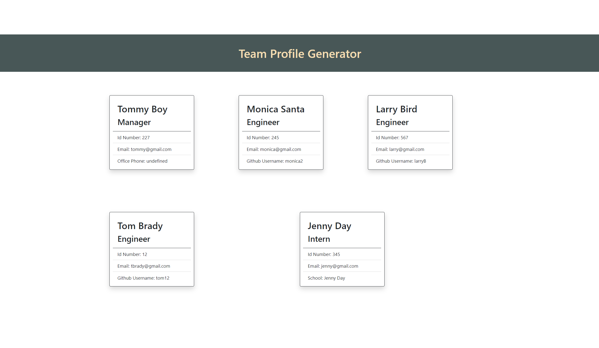

# Team Profile Generator  

## Project Description 
The Profile Generator is a Node.js command-line application that takes in information about employees on a software engineering team, then generates an HTML webpage that displays summaries for each person. Managers and teams can now see each other’s profile and better collaborate. 

## Table of Content

* [Installation](#installation)

* [Usage](#usage)

* [License](#License)

* [Contribution](#Contribution)

* [Credit](#Credits)

* [Test](#Test)

* [Question](#Question) 

## Installation
There are no specific installation instructions.

Below is the URL to the webpage and github repository. 

Website URL: Command-line application so there is not a website URL.

Github repository: https://github.com/synag/team_profile_generator

## Usage
 Please see instructional video link here:https://gallery.moovly.com/video/b037b5c9-ad99-11eb-9a46-06ef0ab4386c 

The sreenshot for the Team Profile Generator is below. 

## License
The license used for this project is BSD 2-Clause License. Here is the license link https://opensource.org/licenses/BSD-2-Clause

## Credits
HTML, JavaScript, Node ( Inquirer, Jest) and CSS

Node

## Contribution
No contribution guidelines

## Test
No Test Instructions

## Questions
Please contact me with any questions.  

* Github username: synag
* Github URL: https://github.com/synag
* Email:  cbenbow@synergisticagility.com 